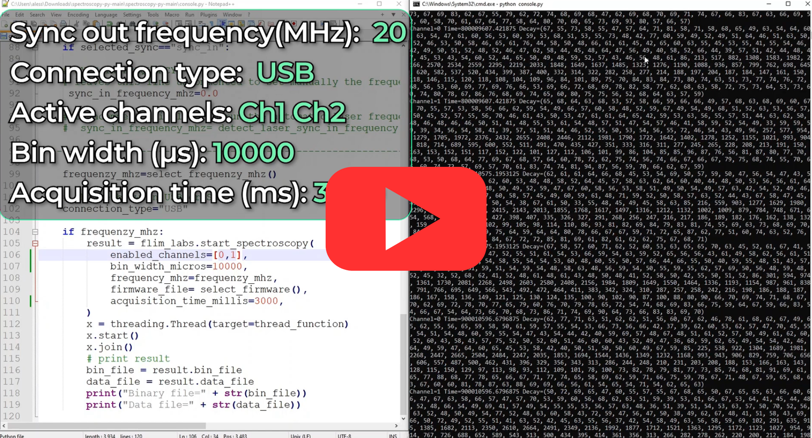

  <h1>Spectroscopy - Console mode </h1>

  

 

<!-- TABLE OF CONTENTS -->

  
Table of Contents

  <ol>
    <li>
      <a href="#console-usage">Console Usage</a>
      <ul>
          <li><a href="#sync-in-frequency">Sync in frequency</a></li>            
          <li><a href="#start-the-data-acquisition">Start the data acquisition</a></li> 
      </ul>
    </li>
    <li><a href="#useful-links">Useful links</a></li>
    <li><a href="#license">License</a></li>
    <li><a href="#contact">Contact</a></li>
  </ol>

## Console usage

The [Spectroscopy](https://github.com/flim-labs/spectroscopy-py) Console mode provides live-streaming data representation directly in the console, without an interface intermediary and charts data visualization processes.
The data displayed on the console screen indicates **the cannel** (number), **the moment of acquisition** (in seconds) and the corresponding **decay curve values** of 256 chart points detected during that time.

Here a table summary of the configurable parameters:

|                           | data-type   | config                                                                                                                 | default                                                                                    | explanation                                                                                                |
| ------------------------- | ----------- | ---------------------------------------------------------------------------------------------------------------------- | ------------------------------------------------------------------------------------------ | ---------------------------------------------------------------------------------------------------------- |
| `sync_in_frequency_mhz`   | number      | set the value manually or set the function detect_laser_sync_in_frequency() to use automatic laser frequency detection | check the [Sync in frequency](#sync-in-frequency) paragraph for more detailed information. |
| `selected_sync`           | string      | choose a value from `"sync_in"`, `"sync_out_10"`, `"sync_out_20"`, `"sync_out_40"`, `"sync_out_80"`                    | `"sync_in"`                                                                                | select whether you will connect to the `sync_in` or the `sync_out` port of your FLIM LABS acquisition card |
| `enabled_channels`        | number[]    | set a list of enabled acquisition data channels (up to 8). e.g. [0,1,2,3,4,5,6,7]                                      | [1]                                                                                        | the list of enabled channels for photons data acquisition                                                  |
| `bin_width_micros`        | number      | Set the numerical value in microseconds                                                                                | 1000 (ms)                                                                                  | the time duration to wait for photons count accumulation.                                                  |
| `acquisition_time_millis` | number/None | Set the data acquisition duration                                                                                      | None                                                                                       | The acquisition duration could be determinate (_numeric value_) or indeterminate (_None_)                  |

 
(<a href="#readme-top">back to top</a>)

### Sync in frequency

Perform this step only if `selected_sync="sync_in"`.

Set the value of the `sync_in_frequency_mhz` variable.  
The value can be set manually by modifyng the line `sync_in_frequency_mhz=0.0`.

Alternatively, the **automatic** laser frequency detection feature, can be used by commenting out the line `sync_in_frequency_mhz=0.0` and uncommenting the line `# sync_in_frequency_mhz= detect_laser_sync_in_frequency()` .

(<a href="#readme-top">back to top</a>)

### Start the data acquisition

Once the variables settings is completed, the software is ready to start the data acquisition.
To run the process the console should be opened inside the project directory `/SPECTROSCOPY-PY` and receive the following commands:

- `python -3.9 -m venv venv`
- `venv/scripts/activate`
- `pip install -r requirements.txt`
- `python console.py`

(<a href="#readme-top">back to top</a>)

## Useful Links

For more details about the project follow these links:

- [Spectroscopy introduction](../index.md)
- [Spectroscopy GUI guide](../v1.0/index.md)

(<a href="#readme-top">back to top</a>)

## License

Distributed under the MIT License.

(<a href="#readme-top">back to top</a>)

<!-- CONTACT -->

## Contact

FLIM LABS: info@flimlabs.com

Project Link: [FLIM LABS - Spectroscopy](https://github.com/flim-labs/spectroscopy-py)

(<a href="#readme-top">back to top</a>)

